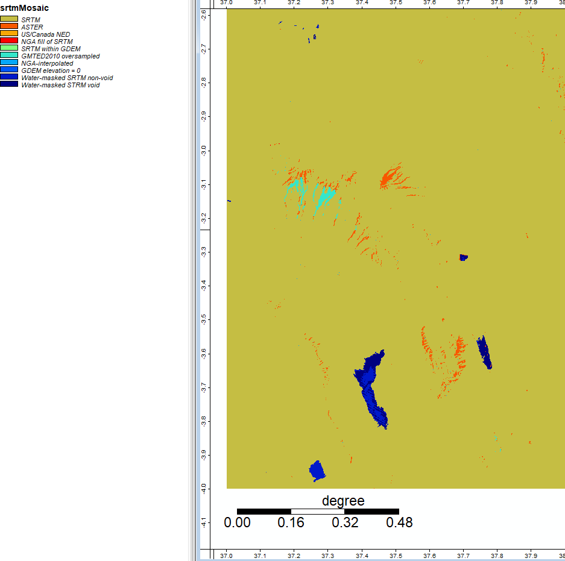
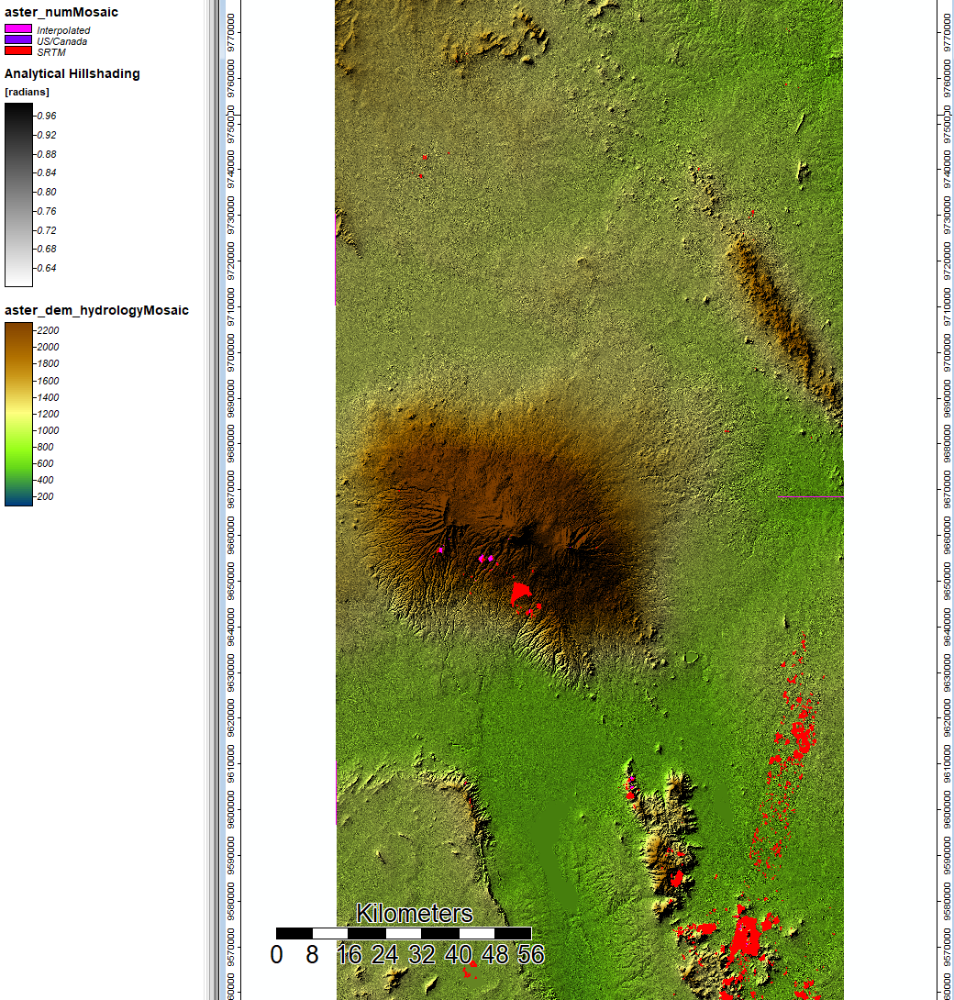
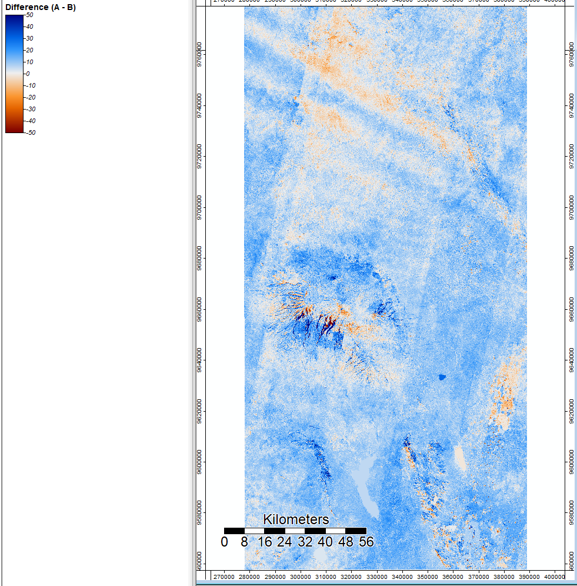
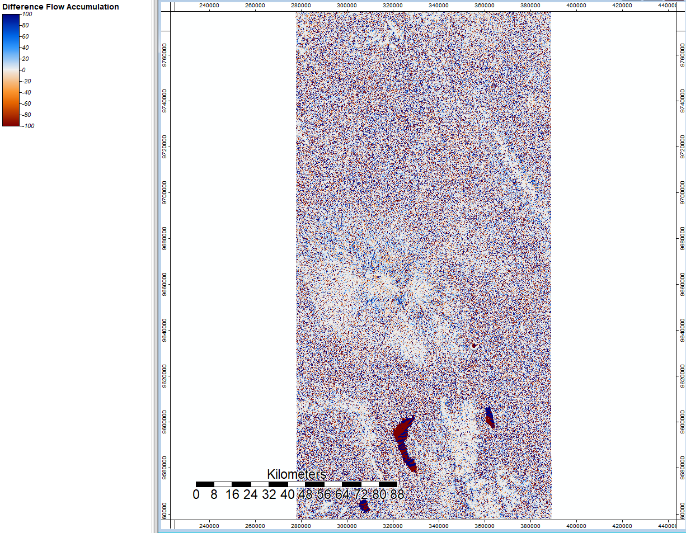

## Global Digital Elevation Models in Week 3

Using ASTER data Model V003 from the US and Japan, I conducted a basic terrain analysis around Mount Kilimanjaro, Tanzania. This analysis was conducted on SAGA open source GIS. Below are the steps of analysis: creating an analytical hillshade visualization, detecting sinks and determining flow through them, removing sinks from the DEM by filling them, calculating flow accumulation, and mapping a channel network to show where streams are.

After projecting the grid into the correct UTM zone (zone 37), rather than using a WGS projection, I created a hillshade visualization. I used an azimuth of 315 and a height of 45, which is standard to show the sun coming from the top left corner.

I then ran a sink drainage route tool to determine sinks and where hydrological features might run through them. The blue shows no sinks, and the colored dots show different values of sinks. 

Then I filled the sinks to create another DEM with the sinks filled in. This looks similar to the original data input but will have all holes due to real topographical changes or data errors removed.

Now we can use a flow accumulation tool to calculate where the water will go. Each value shows accumulation of water in each cell, with darker values showing more accumulation. 

Finally, I ran a channel network to determine where the streams in this landscape are. Once enough water accumulates in each cell from the flow accumulation (as the value increases), then the model assumes that a stream has formed. I overlayed this map onto the hillshade visualization to better see and understand the landscape terrain.

##Week 4 Batch Processing and Error Propagation

For this lab, we looked more closely at the different data sources SRTM and ASTER data pull from. For each pixel, many different scenes are processed from different sources, and sometimes pixels with missing data are filled in from other sources or interpolated from surrounding cells. Digging into the source of data and error can help us understand how error can propagate through models and how to better control for it. 

We started by writing and running batch scripts to automate much of the hydological analysis process. Using batch scripts make it much easier to change the inputs to different steps and compare the outcome, and also allow the user to quickly run a hydrological analysis on their own region with both ASTER [use the model](hydrology_ASTER.bat) and SRTM [use the model](hydrology_SRTM.bat) data. In order to automate the tools, I used the same process described above, but used the specific library and tool number under the properties of each tool in SAGA. From there, I used different options for each tool in command prompts to automate an analysis. We brought in the NUM files for both ASTER [use the model](mosaic_bat_aster.bat) and SRTM [use the model](mosaic_utmproj.bat) and mosaicked them together with the correct UTM projection to visualize the sources of data for each, and then trace back error to different sources of data. 

This image shows the project of a mosaicked and projected NUM file for SRTM, where the majority of the image is data from SRTM (mustard color), but certain areas - particularly steep mountain regions and water bodies - stand out as data from different sources. 

This image shows the ASTER DEM and hillshade visualizations with sources of data not from ASTER. Primarily, the other data sources for these areas are from SRTM or interpolated from neighboring data.

After running both ASTER and SRTM models of the Mt. Kilimanjaro region, I took the difference between the two elevation models to visualize the places of variation and potential error. This image shows SRTM-ASTER using the grid difference tool in SAGA, and you can see that the redder and bluer spots have larger variation between the two layers, and whiter colors are more consistent across both data sources. 

I ran this same tool to look at the difference in flow accumulation between SRTM and ASTER. Though there are more red and blue points across the image, three main spots jump out as containing large differences, and several places contain more white which shows more consistency across the flow accumulation for SRTM and ASTER. 

With all of this information, we can see that steep mountainous slopes and areas with large bodies of water (e.g. lake, canal) can generate error in our analysis and produce different results. The flow accumulation and channel network analysis have larger variation about the water bodies because it is a flat surface; it cannot accuracte tell movement of water with no elevation and cannot accurately determine shorelines. These three areas are three large lakes, as you can tell from background terrain imagery. 

Based on this analysis, I would say that SRTM data is preferable because it makes it easier to distinguish and filter out water-masked elevation features. Also, the sections of very steep slope (shown in bright blue in the visualization of NUM data sources) are taken from a different data source (GMTED2010 oversampled from 7.5 arc second postings) which further clarifies and draws attention to the steep slope, where elevation is less certain. 

Data Sources:
NASA/METI/AIST/Japan Spacesystems, and U.S./Japan ASTER Science Team. ASTER Global Digital Elevation Model V003. 2019, distributed by NASA EODIS Land Processes DAAC

NASA JPL. NASA Shuttle Radar Topography Mission Global 1 arc second. 2013, distributed by NASA EOSDIS Land Processes DAAC

Ran using SAGA version 6.2
