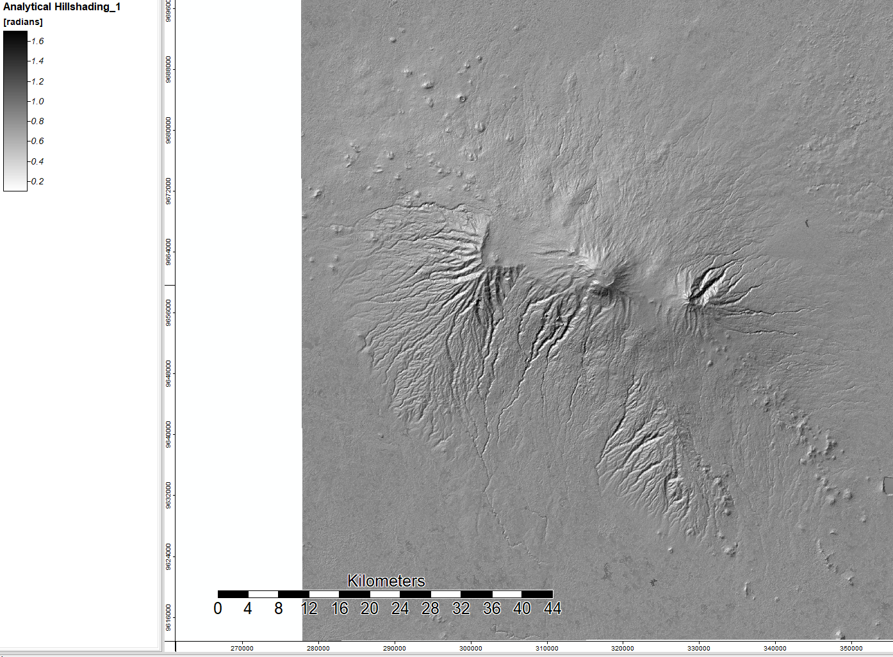
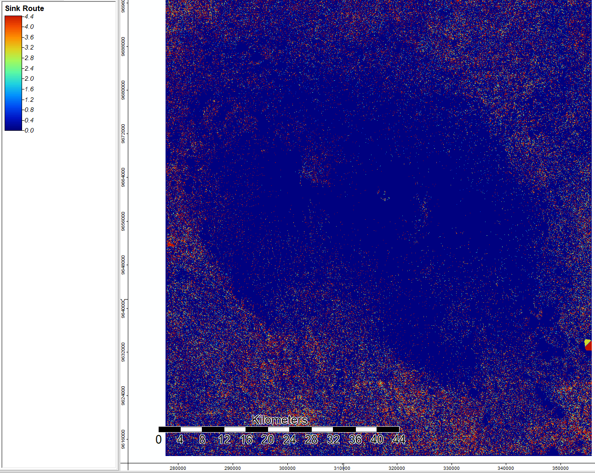
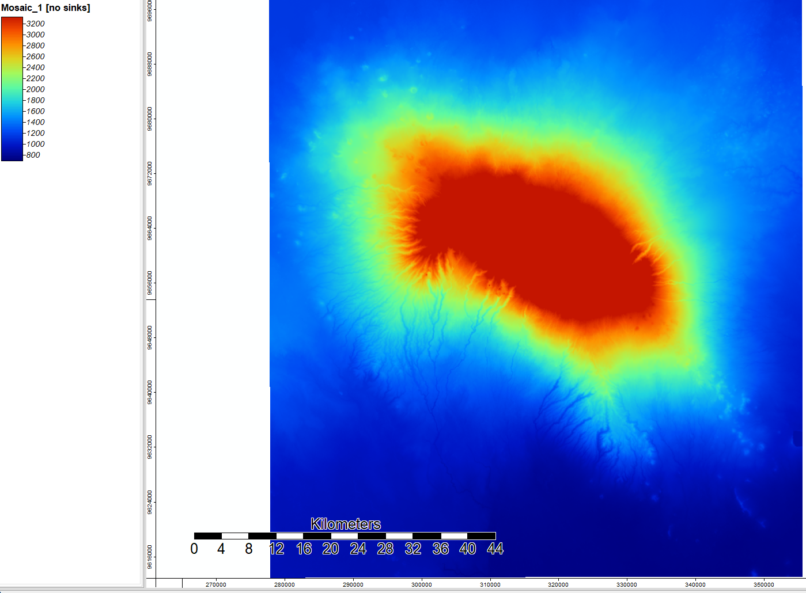
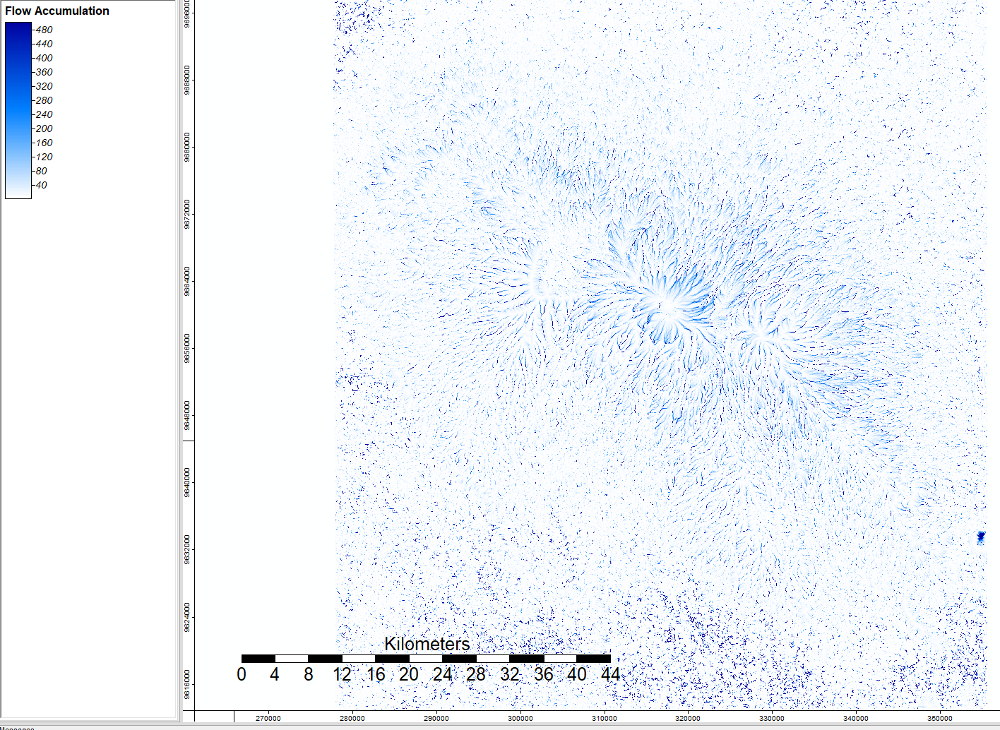
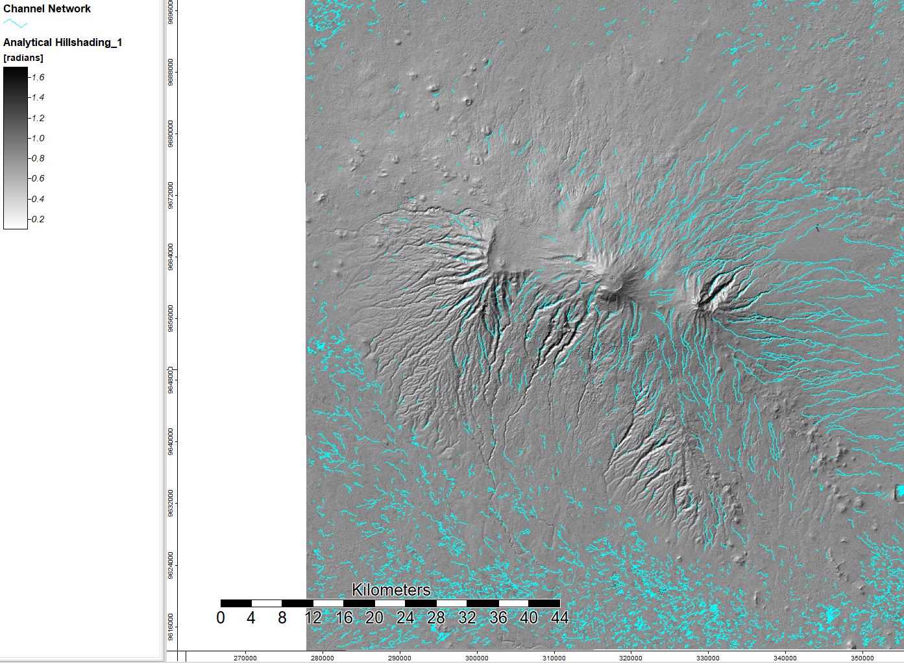

## Global Digital Elevation Models in Week 3

Using ASTER data Model V003 from the US and Japan, I conducted a basic terrain analysis around Mount Kilimanjaro, Tanzania. This analysis was conducted on SAGA open source GIS. Below are the steps of analysis: creating an analytical hillshade visualization, detecting sinks and determining flow through them, removing sinks from the DEM by filling them, calculating flow accumulation, and mapping a channel network to show where streams are.

After projecting the grid into the correct UTM zone (zone 37), rather than using a WGS projection, I created a hillshade visualization. I used an azimuth of 315 and a height of 45, which is standard to show the sun coming from the top left corner.

I then ran a sink drainage route tool to determine sinks and where hydrological features might run through them. The blue shows no sinks, and the colored dots show different values of sinks. 

Then I filled the sinks to create another DEM with the sinks filled in. This looks similar to the original data input but will have all holes due to real topographical changes or data errors removed.

Now we can use a flow accumulation tool to calculate where the water will go. Each value shows accumulation of water in each cell, with darker values showing more accumulation. 

Finally, I ran a channel network to determine where the streams in this landscape are. Once enough water accumulates in each cell from the flow accumulation (as the value increases), then the model assumes that a stream has formed. I overlayed this map onto the hillshade visualization to better see and understand the landscape terrain.

##Week 4 Batch Processing and Error Propagation

This lab drills down further into sources of error, why those sources of error may exist, and exploring different inputs. More description of lab...

We started by writing and running batch scripts to automate much of the hydological analysis process. We also brought in the NUM files for both ASTER and SRTM to visualize the sources of data for each, and then trace back error to different sources of data. 
[Insert all batch processes files]

[visual of NUM files each]

[visual of DEM files each with different sources of data]

[QGIS visuals of error] and explanation. 
