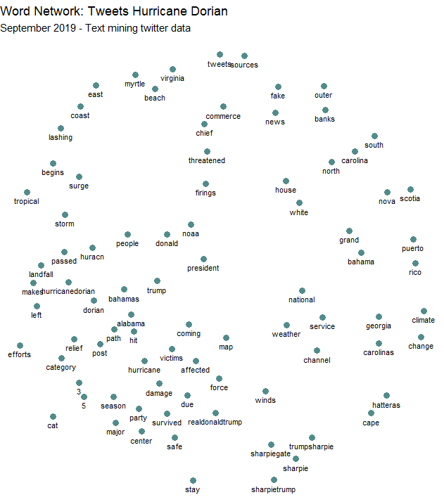

# Analyzing Twitter Activity During Hurricane Dorian

Social media and volunteered geographic information provide new avenues to analyze in real time phenomena across space. By mining data sources such as Twitter, researchers can gain access to big data in real time. While only about 1% of all Tweets have geocoordinates, we can collect large amounts of content specific tweets by using a keyword search in the Twitter API, and then map the location of each tweet. Some tweets may use the specific coordinates of the user’s location if geo-location is enables, or the tweet may be generalized to a neighborhood, city, county, state, or country level depending on the user’s profile and privacy settings. For lab 10, we analyzed the distribution of tweets about hurricane Dorian in the Eastern United States to understand whether the actual storm surge or President Trump’s sharpie maps had more of an influence on driving Twitter activity. 

## Data and Software
This analysis was conducted using RStudio Version 3.6.1, QGIS Version 3.8.1, and GeoDa. 

Using code developed by Professor Holler, we mined Twitter data from September 11, 2019 that contained keywords “dorian,” “hurricane” or “sharpiegate” to obtain 200,000 tweets. This datalayer is named "dorian" in the R-script and SQL code. We also downloaded 200,000 tweets from November 19, 2019 in order to understand the baseline Twitter activity across space, named "november". 

Download csv files of the Status IDs of the twitter data used:
[Dorian tweets](dorianData.csv)
[Novemeber tweets](novemberData.csv)

Download the code used in each step of the analysis:
[R-script](dorianTwitterScript.R)
[SQL Code in PostGIS for QGIS](dorain.sql)

## Content Analysis in R: Common Language and Word Associations
First, I conducted a content analysis of the most [common keywords](CountWords.png) in tweets during the storm. After removing stop words – filler words that are not specific to the content – I found the “hurricane,” “dorian,” and “alabama” were the most common three words, closely followed by “sharpiegate”. Notably, “bahamas”, “storm” and “people” were also used over 500 times in the 10,000 tweets, as were “trump” and “realdonaldtrump”. This suggests that content was divided along words that we would expect during a natural disaster, and referring to the President. 

An analysis of associations among these keywords proves more interesting. Finding pairs of words that are used together more than 30 times reveals interesting clusters of words. 

This figure shows a cluster of keywords related to Trump’s sharpie hurricane map, with “sharpiegate,” “sharpie,” “trumpsharpie,” and “sharpietrump”. “Fake” and “news” are also closely associated, as are “stay” “safe” and “storm” “surge”. The place names of affected areas also tend to cluster together in the upper right part of the figure. This diagram starts to give us an idea what the primary concerns and topics of tweet content during Hurrican Dorian were: affected places and people’s safety, Donald Trump’s spread of misinformation about the storm. These broad topics are similar to Wang et al.’s cluster analysis of tweets during wildfire hazards in California: they found clusters based on topics of affected areas, staying safe and showing appreciation for firefighters, and the role of news media and local authorities. Clearly, President Trump’s twitter, @therealdonald, has more authority and spread through retweets and content sharing in the case of Hurricane Dorian.

## Spatial Hotspot Analysis
But did this affect the spatial distribution of tweets about the storm? I conducted several spatial analyses to normalize twitter activity across space and find clusters of activity in the Eastern United States. First, I used an API from the US Census to acquire and upload all US counties into my PostGIS database. I also pushed all the data from twitter into PostGIS and transformed the three layers to have the US A Contiguous Lambert Conformal Conic projected coordinate system. This spatial reference system preserves distance and area across the Eastern US pretty well. I then clipped the counties layer to include only the counties within states in the East, where the bulk of the tweets were located: [see this initial map](hurricanetweetsmap.PNG). Next, I counted the number of hurricane tweets in each county and normalized based on two different metrics. I calculated the number of tweets per 10,000 (tweets about storm/ population * 10,000) to normalize by population, and I also calculated a normalized tweet difference index to normalize the hurricane tweets (tweets about storm – baseline twitter activity)/(tweets about storm + baseline twitter activity) based on the baseline twitter activity in each county from November. 

This map shows the amount of twitter activity during Hurricane Dorian compared to baseline number of tweets based on our sample from November. Areas with higher values, in darker red, show a higher proportion of twitter activity during the storm than normal, and values close to negative one, in white, are places that had a lower amount of twitter activity during the storm than our baseline sample. You can see pockets of counties with more storm activity in North Carolina, South Carolina, and Florida. To visualize this with continuity across space, I created a [Kernel Density heatmap](HeatMap.pdf) of tweet activity during the storm, based on tweet location, using a threshold distance of 106, 021 weight matrix. I used a radius of 100 kilometers to allow for some overlap between counties to create continuity, and a pixel size of 500. To get a less course map, you could reduce the pixel size. This map shows a large hotspot of twitter activity during the storm on the coast of North and South Carolina, and another smaller hotspot in Massachusetts. These locations make sense, as they were some of the hardest hit locations by the storm surge. 

Further, a [spatial hotspot analysis](tweetratesp05.png) of tweets normalized by population revealed locations of high significance. Coastal North and South Carolina as well as some parts of Florida have significantly higher twitter activity about the storm than expected based on population, and further inland throughout the Midwest has significantly lower clustering at an alpha level of 0.05. When looking at places that have significant [spatial clustering at the 0.001 level](tweetratesig.png), several counties in North Carolina remain significant and pockets in Illinois and throughout the Midwest are still significantly negative. 

Overall, this shows that both the real storm surge path of hurricane Dorian and President Trump’s sharpie map of the storm influenced the content of Twitter activity during the storm. However, it seems that the storm’s actual pathway had a large effect on the spatial distribution of tweets: areas in North and South Carolina were more significantly clustered than in Alabama. This analysis was primarily inductive, which is similar to many Twitter use cases we have looked at as a class. It seems that Twitter data lends itself to more exploratory research on content, user sentiment, and location, rather than being hypothesis driven and grounded in theory. There is no doubt that this more bottom-up method of knowledge creation and data collection provides different benefits, getting access to real time data from a variety of people. Yet it also has its limitations, especially in geographic contexts. Because such a small percentage of total tweets have geographic information, and it is not always exactly precise, we may be selecting a certain subset of the population when analyzing only geographically relevant tweets. 

