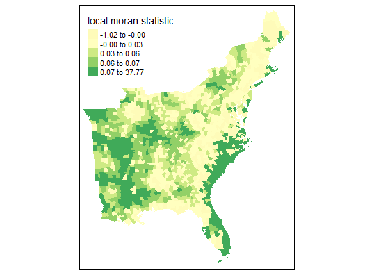
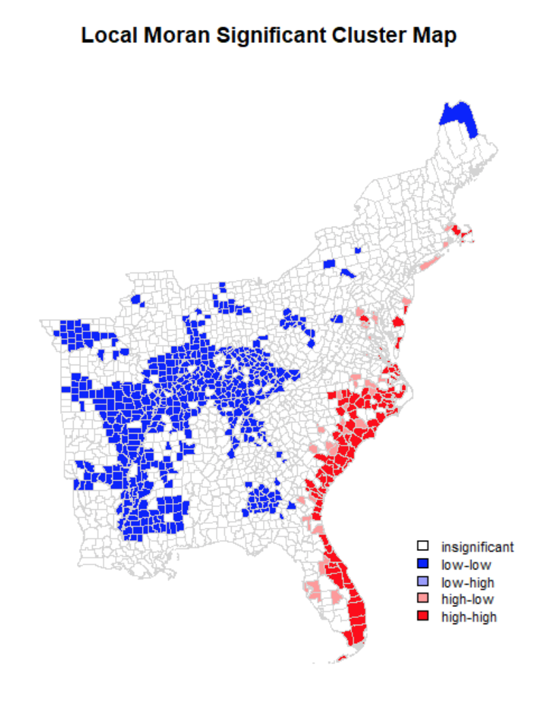

# Spatial Autocorrelation in R
## Final GIS Project

For my final project, I am replicating the spatial autocorrelation and cluster analysis in labs 9 & 10 with twitter data in R. While GeoDa is an intuitive and easy tool, it does have some limitations with freedom with changing weight matrices and struggles with large datasets. By utilizing the `spdep` package in R, the same spatial autocorrelation tests can be run - and with a greater understanding of what the tool is doing! This process has several steps: first, we need to create neighbor objects, which will be the basis for creating a weight matrix. Then, different statistics such as Local Moran's I, and Getis Ord Gi* can be calculated and plotted. 

## Data
I will be using the same dataset used for the [Twitter labs 9 & 10](dorian2.md). By using a dataset I previously analyzed and am familiar with, we can directly compare results for maximum reproducibility across softwares. This is helpful when understanding each step of the analysis and output because we have an idea of the expected results. View the [Twitter lab](dorain2.md) to understand how we acquired and analyzed the data. My primary variable for this analysis is the tweet rate we calculated with tweets during the storm normalized by census tract population. 

Download the analyzed twitter data:[Census Tract Shapefile with Tweet Rate](FinalProj.zip)

Use the R file with code and documentation: [Spatial Autocorrelation in R](SpatialAutocorrelationR.R)

## Setting Up Workspace
For this analysis, I am using RStudio Version 3.6.1, and packages `spdep` for spatial autocorrelation tools, `sf` for reading and interpreting data, and `RColorBrewer` for plotting and mapping outcomes. To set up the workspace, we will start by installing and calling these packages, as well as pointing the working directory to the same folder with the data saved as a shapefile. 
```
install.packages(c('spdep', "sf", "RColorBrewer"))
library(spdep)
library(sf)
library(RColorBrewer)

#Set working directory to GIS W Drive
setwd("W:/Open_Source/FinalProj")

#Import the spatial data to R, using the counties with the comined twitter count and rate from lab10
tweets.sf <- st_read("countiesTweets.shp") #reading a shapefile
head(tweets.sf, n=4) #list spatial object and the first 4 attribute records to see data

#Converting and sf object to a spatial object
tweets.sp <- as(tweets.sf, "Spatial")
plot(tweets.sp) #see basic view of data and county outlines 
```

## Creating Spatial Neighbors
One of the first steps in this analysis is to create a neighborhood matrix, which creates a relationship between each polygon. Because spatial autocorrelation is testing clustering by objects that are near each other, it is important to define what "near" means for the dataset. I test several different measures of nearness for this analysis. 
#### Threshold Distance 
I will start with a threshold distance analysis, because this is the wiehgts matrix we used for the spatial hotspot analysis in GeoDa in [lab 10](dorian2.md). Distance based neighbors defines a set of connections between polygons based on a defined Euclidean distance between centroids. Therefore, the first step is to get the centroids of the polygons, and then we can use the function `dnearneigh` from the `spdep` package installed earlier. We also have to include each county as it's own neighbor, including the tract itself in the weight matrix.
```
coords <- coordinates(tweets.sp)
thresdist <- dnearneigh(coords, 0, 106021.2, row.names = tweets.sp$geoid)
thresdist <- include.self(thresdist)
```
To continue with the threshold distance part of the analysis, jump to the next section. But read on to first create several other measures of neighbors that we can use for comparison later.

#### Queen Contiguity
Whereas distance based neighbors depend on relative evenness of distribution of object, contiguity based relations are better to use for irregular polygons that vary a lot in their shape and size. Contiguity ignores distance, and instead focuses on the location of an area. A First order queen contiguity neighborhood matrix defines a neighbor when at least one point on the boundary of a polygon is shared with at least one point of its neighbor. We can use the `poly2nb` function to create this matrix:
```
nb.foq <- poly2nb(tweets.sp, queen = TRUE, row.names = tweets.sp$countyns)
```
We can also create higher order neighbors that are helpful when looking at the effect of lags on spatial autocorrelation. While this is not the main focus of this analysis, it could be helpful when applied to other datasets.
```
nb.soq <- nblag(nb.foq, 2)
```
We can call `nb.foq` and `nb.soq` to see the total number of regions, the number of nonzero links, percentage nonzero links and weights, the average number of links, and the number of regions with no links. This dataset has 2 regions with no links, which is important to note to handle later in the analysis. 
As an alternative to queen contiguity, you could also create a first order rook contiguity neighborhood matrix. It is smilar to queen contiguity, however it does not include corners for the polygons- only polygons that share more than one boundary point. You would still use the `poly2nb` function, but make the parameter `queen = FALSE`.

## Creating a weight matrix 
We can then create a weight matrix based on the assigned neighbor objects. I will continue this part of the analysis with the threshold distance neighborhood matrix, but you can use the same syntax with your desired neighbor object definitions. Because there are regions with no neighbor links, we have to use `zero.policy = TRUE`.
```
nbweights.lw <- nb2listw(thresdist, zero.policy = T)
```

## Local Measures of Spatial Autocorrelation
Local measures, consider spatial variation in each place as opposed to finding one statistic for the whole dataset - as global measures do.

#### Local Moran's Spatial Autocorrelation
To calculate a cluster analysis based on Moran's statistic, we can use the `localmoran` function, which will create an output of 5 columns of data. We want to copy some of the columns (notably the I score in column 1 and the z-score in column 4) into the spatial dataframe, and then we can plot the output.
```
locm <- localmoran(tweets.sf$tweetrate,listw = nbweights.lw, zero.policy = TRUE)
#Copy some of the columns into the spatialPolygonsDataframe
tweets.sp@data$BLocI <- locm[,1]
tweets.sp@data$BLocIz <- locm[,4]
tweets.sp@data$BLocIR <- locm[,1]
tweets.sp@data$BLocIRz <- locm[,4]

#Now map the local Moran's I Outputs
MoranColors<- rev(brewer.pal(7, "RdGy"))
breaksMoran<-c(-1000,-2.58,-1.96,-1.65,1.65,1.96,2.58) #based on standard deviations of significance
plot(tweets.sp, col = MoranColors[findInterval(tweets.sp@data$BLocIRz, breaksMoran, all.inside = T)], axes = T, asp = T)
```
We can also create a plot of the significant clusters of local Moran scores. To do this, we have to derive the quadrants of significance (high-high, high-low, low-high, and low-low), and then set a coloring scheme. 
```

tweetrate <- tweets.sf$tweetrate

# Define significance for the maps
significance <- 0.05

# Create the lagged variable
lagvar <- lag.listw(nbweights.lw, tweetrate, zero.policy = T)

#Center the variable around the mean, compariing the lagged variable and the number of tweets
meantweet <- tweetrate - mean(tweetrate)
meanlag <- lagvar - mean(lagvar)

# Derive quadrants 
q <- vector(mode = "numeric", length = nrow(LSOAloci))
q[meantweet < 0 & meanlag < 0] <- 1
q[meantweet < 0 & meanlag > 0] <- 2
q[meantweet > 0 & meanlag < 0] <- 3
q[meantweet > 0 & meanlag > 0] <- 4
q[locm[,5] > significance] <- 0 # assigns places that are not significant a category of 0

# set coloring scheme
brks <- c(0, 1, 2, 3, 4)
colors <- c("white", "blue", rgb(0, 0, 1, alpha = 0.4), rgb(1, 0, 0, alpha = 0.4), 
            "red")
plot(tweets.sp, border = NA, col = colors[findInterval(q, brks, all.inside = FALSE)])
plot(tweets.sp, add = TRUE)
box()
legend("bottomright", legend = c("insignificant", "low-low", "low-high", "high-low","high-high"), fill = colors, bty = "n", cex = 0.7, y.intersp = 1, x.intersp = 1)
title("Local I Cluster Map")
```
#### Hotspot Analysis: Getis-Ord Gi*
MORE on the tool and what it does. 
First, use the `localG` function to get the Gi* statistic for the hot and cold spots in the data, then view the numbers to ensure the values are in the ballpark of what you would expect (2.58 standard deviations away from the mean). Then, add these values to the spatial dataframe, and map the outputs. I am using a significance level of 0.05, which is 1.96 standard devaiations from the mean.
```
locG <- localG(tweets.sf$tweetrate, listw = nbweights.lw, zero.policy = TRUE)
head(locG)
#Add to the spatial dataframe
tweets.sp@data$locGi <- locG

#Map the Outputs
breaks<- c(-100, -1.96, 1.96) #manually assign breaks for the significance level you want
GIColors <- c("blue", "white", "red")
plot(tweets.sp, col=GIColors[findInterval(tweets.sp@data$locGi, breaks, all.inside = TRUE)], axes = F, asp=T)
box()
legend("bottomright", legend = c("low", "insignificant", "high"), fill = GIColors, bty = "n", cex = 0.7, y.intersp = 1, x.intersp = 1)
title("Gi* Cluster Map by Counties")
```

## Results
First, I used the same threshold distance (Euclidean distance of 106021.2) that was automatically generated in GeoDa software. This produces many neighbors and connections - more so than queen contiguity or 6 k nearest neighbors. The initial map of Local Moran's Statistic shows familiar patterns, and we can begin to see areas of spatial autocorrelation. Yet based on this map alone, it is not possible to understand if these are clusters of high or low values (pretending we didn't already know the outcome from the [map in the previous analysis](tweetratesp05.png) in GeoDa...)

<p align= "center">

</p>

When mapping the significant clusters along the quadrants of spatial activity, a clearer map begins to take shape. We can see that the coastal areas of North and South Carolina, continuing into Florida, have higher hotspots of twitter activity during hurrican Dorian compared to the census tract populations. Inland United States, however, has significantly lower twitter activity - which is in line with my findings from the previous lab. 

<p align= "center">

</P>

However, the map produced from using the same threshold distance for the Getis-Ord Gi* hotspot analysis looks notably different for areas of "coldspots" or significantly negative twitter activity per 10,000 people. While you can see almost identical hotspots to the original analysis along the coastal region of the East, very few counties are significanly negative. This is curious, because the neighbor variables and weight matrix seem to be functioning similarly to how we would expect, and [this map](gstat.png) plots the value of the Getis-Ord Statistics. The Gi Statistic is represented as a Z-score. Greater values represent a greater intensity of clustering and the
direction (positive or negative) indicates high or low clusters. Clearly here, values that are significant and in a negative direction are not appearing correctly. I tried this method altering several different methods of plotting and using different arguments, however it did function with more success on NDTI. 


Running these two analyses with different neighborhood matrices produced similar results for this data, though that is not always the case for different datasets. It can be helpful to visualize the connections for comparison and selection by using command:
```
```

## Takeaways and Conclusion
Although less intuitive and quick than GeoDa for spatial autocorrelation tests and hotspot analyses, R allows the user more possibilities. It is possible to manually change a neighborhood objects, to control and assign different values to objects that have no neighbor connections. R also allows us to conduct a cluster analysis on a much larger dataset because it can efficiently compute large matrices and is optimized to handle big data, whereas GeoDa has a long processing time. Lastly, because there are more inputs, arguments, and steps for running spatial autocorrelations in R, there is more opportunity for critically assessing the analysis and possible errors. 

## References
Acarioli. (2017). Global and Local Measures of Spatial Autocorrelation. Retrieved from https://aledemogr.com/2017/10/16/global-and-local-measures-of-spatial-autocorrelation/

Acarioli. (2015). Creating neighborhood matrices for Spatial Polygons in R (updated). Retrieved from https://aledemogr.com/2015/10/09/creating-neighborhood-matrices-for-spatial-polygons/

Dennett, A. (2016). Practical 6: An Introduction to Analysing Spatial Patterns. Retrieved from: https://rstudio-pubs-static.s3.amazonaws.com/126356_ef7961b3ac164cd080982bc743b9777e.html

Ludwig-Mayerhofer, W. (2016). Internet Guide to R: Defining Neighbors, Creating Weight Matrices. Retrieved from http://wlm.userweb.mwn.de/R/wlmRspma.htm

O’Sullivan, D., & Unwin, D. (2010). Local statistics. In Geographic Information Analysis, 2nd Edition, Chapter 8. Retrieved from https://rspatial.org/raster/rosu/Chapter8.html

