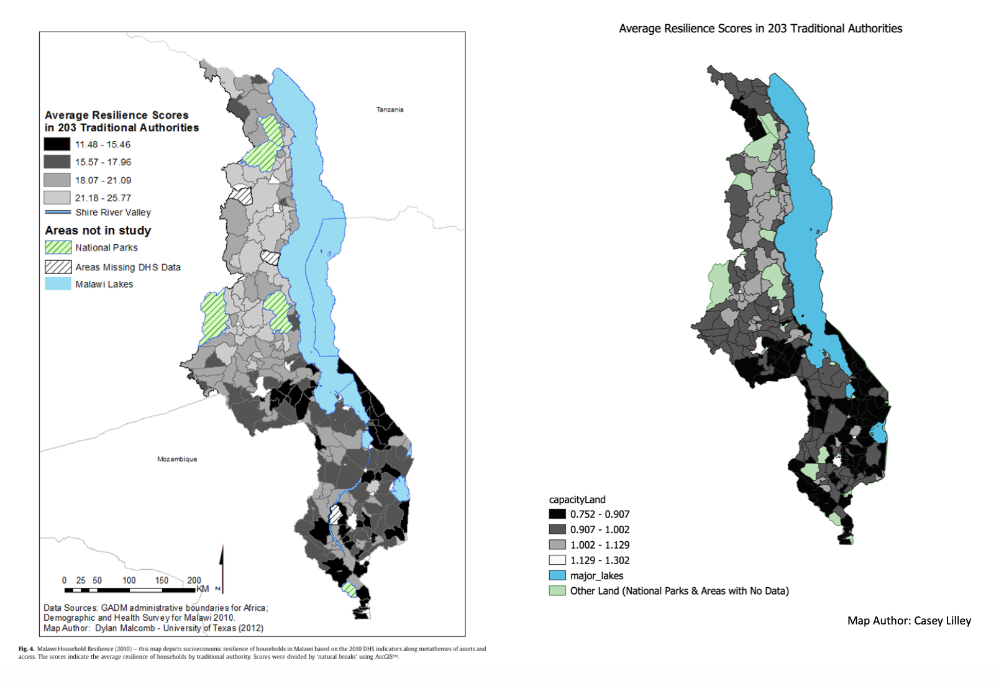
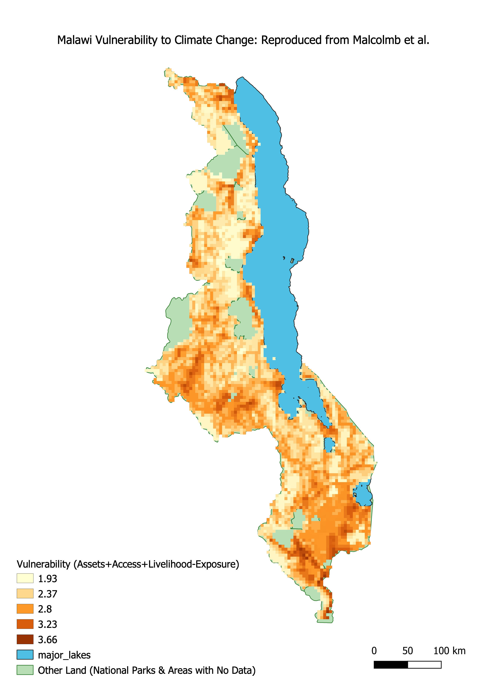

# An Investigation into Reproducibility in GIS: Vulnerability Analysis in Malawi based on methods from Malcomb et al. 

Reproducibility, or obtaining the same results with the same input data, methods, and code, in GIS is a common problem, as many studies have not been critically analyzed. Creating more rigorous and transparent methodology in geographic research would not only benefit academic learning in the field, but would also encourage more collaboration and discourse between geographers. Further, issues of reproducability and replicability in vulnerability modelling is compounded. "Measuring" vulnerability can be misleading because there is no standardized set of indicators or clearly defined policy problems solved by indicators (Hinkel 2010). Vulnerability it difficult to conceptualize because it requires synthesizing many complex factors into a single element. This has led to a plurality of different approaches to and definitions behind vulnerability modeling (Hinkel 2010). It is important to critically analyze the framework behind vulnerablity studies in order to more collaboratively agree on more specific terminology for vulnerability indicators and policy uses, in order to avoid falling into the misleading pitfall of "measuring" vulnerability (Hinkel 2010). Thus, geographic research on vulnerability has to be able to clearly define methods and data, to encourage reproducibility and replicability. To learn about vulnerability frameworks and conducting multi-criteria analyses, as a class we tried to reprocude findings from Malcomb et al. on climatic vulnerability in Malawi. The authors highlight that they use "locally derived indicators and granular data in a transparent and easily replicable methodology" to avoid many of the dangers and pitfalls in vulnerability mapping analyses. We investigated the extent to which this is true.

## Malcomb et al.'s Methodology
Malcomb et al. analyzed the drivers of vulnerability at the household level in Malawi with the intention of creating a policy relevant climatic vulnerability model that can address what areas are most vulnerable and where development solutions should be applied. They utilized elements of exposure, sensitivity, and adaptive capacity to calculate an overall vulnerability assessment across Malawi. After conducting interviews with households to better understand perceptions of climate change, adaptation, governance, vulnerability, and foreign aid, Malcomb et al. quantified the relative importance of different factors contributing to assets of land, livestock, and income, and access to markets, food, water, health care, and labor, livlihood sensitivity based on crop productivity and natural resource use in recovering from disasters, and finally physical exposure to recurring floods and droughts. The authors then used data from the Demographic and Health Survey, Famine Early Warning Network, and UNEP/ GRID-Europe to populate the fields they found to be important in each element of vulnerability. This table shows the primary framework of indicators they used, and the weights they assigned them based on their local knowledge through interviews and previous literature on vulnerability. 

They then normalized each indicator variable from zero to five to represent the varying conditions for a household, with zero being the worst and five benig the best. The authors also disaggregated the DHS indicators to the village level, and then combined them to conduct the analysis at the administrative scale of Traditional Authorities. The overall score is then represented by the equation: household reselience = adaptive capacity + livelihood sensitivity - physical exposure, creating a composite map.

## Methodology to Reproduce Analysis
Data Sources:
- DHS Survey Data: Apply for the data and agree to confidentiality terms on the DHS [website](https://www.dhsprogram.com/Data/)
- DHS [Cluster points](https://dhsprogram.com/What-We-Do/GPS-Data-Collection.cfm)
- Traditional Authorities [Shapefile](traditional_authorities.zip) for Malawi with 2 versions from the Census and GADM
- Estimated flood risk for flood hazards and exposition to drought events from the [UNEP Global Risk Platform](https://preview.grid.unep.ch/)
- [GADM version 2.8 Boundaries](https://gadm.org/download_country_v2.html) for Malawi, retrieved in Fall 2019 because Malcomb et al. does not specify when they downloaded the boundaries or the version
- [FEWSnet Livelihood Zones](https://fews.net/fews-data/335)
- [Major Lakes](http://www.masdap.mw/layers/geonode:major_lakes) from Open Street Map, using MASDAP
- DHS Survey Region [boundaries](http://spatialdata.dhsprogram.com/boundaries/#view=table&countryId=MW)

Using QGIS Desktop 3.8.1 with GRASS 7.6.1, this analysis used WGS 84 for the coordinate reference system (EPSG:4326). In my final analysis, I used a 2.5 minute resolution (0.04166666 decimal degrees), rather than the initial 5 minute resolution (0.08333333 decimal degrees) that was coarser. I used an extent of 32.66,-17.125: 35.875,-9.375, based off the drought layer that was correctly clipped to Malawi. 

### Adaptive Capacity - Summarizing DHS Surveys by Traditional Authority 
[sql code](vulnerabilitySQL.sql)

By examining the metadata for the DHS survey data, we collaboratively extracted the variables in Malcolm et al.'s assets and access analysis. As a class, we each got assigned a variable and wrote the SQL code to reclassify the data into quantiles. We dropped no data and null values within each of the 12 indicator variables, and then reclassified them in quintile ranks. We used best judgement to decide whether high or low values for each variable should be 1 or 5, based on what is more favorable for each variable. Then, to preserve the anonynmity of the DHS data, Professor Holler put together and polished the SQL code and gave us the aggregated data on the TA level. This is Malcomb et al's Figure 4, a map of average resiliency scores compared to our final version of the analysis. For one, our units were not the same, and we found higher pockets of high vulnerability areas in the center of the country.

### Sensitivity 
Malcomb et al. used data from FewsNET 2005, which was not available, so we had to cut this part out of the analysis. Therefore, the final product at best is 80% the orginial analysis because the livelihood sensativity accounted for 20% of the final result. 

### Exposure
We quickly realized several potential issues for this part of the analysis. We had to download the *global data layer* for flood risk because the data for Malawi was incomplete, and the data for Africa was mislabelled - it is actually population exposure to risk. After you download the data from the [UNEP Website](https://preview.grid.unep.ch/), we need to load the layers into PostGIS with a `raster2pgsql` command-line program. Further, we have to clip areas out, using `st_clip` that are not included in Malcomb et al.'s work - including major lakes and national parks. We then resampled the layers to match each other, using a warp cell size with bilinear resmapling and a clip to restrict the analysis to the extent of Malawi. We first had to do a buffer to eliminate sliver polygons. The we recoded both layers to be on a quantile scale. For flood risk, this was simple because values were listed from 0-4, so by performing a raster calculation and adding 1 to each cell I normalized the values 1-5. For drought exposure, I used GRASS tools `r.Quantile` and `r.Recode` to reclassify the values into quantiles. 

## Making the Model: Putting it all together
Finally, we put these data sources together to try to reproduce Malcomb et al.'s Figure 4. Professor Holler gave us an initial [model](vulnerability.model3) to clip and correctly rasterize each layer so they match. This analysis used a geographic reference system of WGS 84 - EPSG:4326. Then I did the reclass steps described above for flood and drought risk layers, and combined all layers with a raster calculator based on Malcomb et al.'s equation. We needed to invert the adaptive capacity score so that a high score for capacity correlates with a high vulnerability. Thus, the equation was ((2-Adaptive Capacity)(0.40)) + ((Drought Exposure)(0.20)) + (Flood Risk(0.20)). But this [initial map](coarseMalc.PNG) was at a coarser resolution than Malcolm et al.'s model, so I altered the [model](vulnerability.Finer.model3) to include a parameter to define resolution. [image of model2](ModelResolution.JPG) This parameter defaults to 0.041667 decimal degrees - the final resolution I used - but a user can input their own number. This produced a final map pictured below.

## Analysis and Discussion
Clearly this map has notable differences from the Figure presented by Malcomb et al., despite our efforts as a class to closely follow the methods to reproduce the results. Notably, you can see different pockets of high vulnerability in the Northern region of the country, and overall there appears to be higher vulnerability in our version of the analysis than Malcolm et al.'s.

This research is not reproducible, despite the authors' claims to transparent and replicable methodology, for several reasons. When viewing the paper through the lens of Tate's analysis of different vulnerability models, several key parts of the analysis stick out as either unreproducible or uncertain. While the indicator set and weights were clearly defined in a reproducible way, issues of data accessibility, measurment error, transformation and normalizing caused this analysis to be unreproducible.

First, the data accessibility proved a challenge. We were unable to access the FEWSNet data for livlihood sensativity - 20% of the final analysis. And even with the DHS Survey Data and UNEP exposure data we were able to get, it was unclear which exact layers and variables the authors used so we used best judgement. For example, the UNEP flood layer for Malawai was clipped incorrectly, and labeled as population exposure to risk, so we used global data. Secondly, there were several issues with the vulnerability framework and methods that prevent this study from being reproducible.

Malcolm et al. uses a hierarchical model, meaning that conceptually the model uses 10-20 indicators divided into subgroups to capture a more generalized definition of vulnerability across access to resources, livelihood, and exposure to multiple hazards (Tate 2012). The paper does a good job describing their indicator set - grounded in interviews - to highlight the local perspective of what is most important in vulnerability. They then present the results of this in a clearly defined table (see Table 2 above) that we referred to many times throughout our analysis. Yet Malcolm et al. uses traditional authorities and a raster grid as their two primary analysis scales, which raises questions about uncertainty in the data. While the Traditional Authorities unit of analysis may be the most directly useful to policy implications because "many projects and assessments are organized at the TA level," it is produces a high degree of uncertainty in this analysis. The DHS household surveys have an uncertainty level at the district level, so trying to break it down to a finer unit of analysis could potentially place household information in the wrong TA. The authors do not acknowledge this source of error and uncertainty and suggest that their results are applicable on a finer scale than should be appropriate. 

Further, Malcolm et al. do not provide measurement error or apply a sensativity analysis to characterize the importance of the
measurement error in the dataset (Tate 2012). After removing households with no data for any of the indicator variables, we were left with a relatively small sample set, which raises questions about the representativeness of the sampling. The authors were also unclear about their steps in data transformation, which is a highly influential step that "should receive the highest level of methodological scrutiny in the development of social vulnerability indices" (Tate 2012, 341). It is unclear, for example, if raw counts, proportions, or density of sick people per household was used. Considering the household size in proportion or density measurements would make sense for equal comparison across the country, yet Malcomb et al. does not explain what measurement they used so we used raw counts. This definitely changes the outcome of the analysis. 

Additionally, although Malcomb et al. specified their normalization methods through a quantile rank, we had to make judgement calls when reproducing the analysis. Many of the indicator variables for assets and access are binary variables: a household either owns a cell phone or they don't. Yet to convert to a quantile ranking before combining them into an aggregate score, we had to make decisions about the best way to assign values 1 to 5 to each binary variable because it is unclear in their methodology. Do they give the households without a cell phone a 1 and with a 5? Or values of 2 and 4 to be less polarizing? Further, the very premise of quantile ranking for this type of variable is problematic because it gives the idea that the authors have more precision than they actually have in their analysis. 

The penultimate step outlined in Tate's stage of construction - weighting - is clearly defined and described. As mentioned above, the paper clearly describes their indicator set and grounds their decisions for each variable weight in local interviews. The weighting approach is the main driver of uncertainty for the hierarchical model type, so it is beneficial that Malcomb et al. explains their interview results and metathemes (Tate 2012). Lastly, the authors added the weighted indicators to achieve the final aggregated index. 

As mentioned above, Malcomb et al. did not adequately acknowledge potential error and uncertainty in this analysis. The case could have been strengthened by a sensativity analysis or a model of uncertainty for the location of DHS cluster points. It is also possible that a small error in the indicator set or standardization scheme propagated to affect the final vulnerabiliy score. Because the results could be used for potential policy initiatives and funding allocation and mapping phenomena projects authority and certainty, explicitly acknowledging limitations is important to avoid misinterpretation, especially in the case of vulnerability indices. Further, the authors do not include the actual data from their interviews, just the results and the metacodes they derived from conversations. Using this complex information to populate data tables and assign weights also introduces elements of uncertainty: their presentation of data does not account for nuances in semantics and meanings from the interviews (Schuurman 2008).

This case study has demonstrated just how important it is to make sure that the referent, the symbol, and the concept align as closely as possible, and that the authors are explicit in every step of their decisions and methodology. Providing the initial data and a GIS model they used would've greatly benefitted us in our analysis, and would have allowed us to more accurately reproduce the study. This is important to break down the "black box" of GIS and vulnerability indices. Because such a high level of variability and uncertainty exists in creating social vulnerability indices, I am doubtful that they are ever fully replicable. Hinkel and Tate have demonstrated that there is no one size fits all framework for vulnerability, with large variations in conceptual understandings, semantic definitions, and indicator choices across vulnerability studies (Hinkel 2010; Tate 2012). Additionally, vulnerability studies have to critically examine the purpose of their work, and make local decisions for how and if it should be measured. This makes replicability in the field very difficult, but reproducibilty can certainly be improved. 

## Resources
Hinkel, J. (2011). “Indicators of vulnerability and adaptive capacity”: towards a clarification of the science–policy interface. Global Environmental Change, 21(1), 198-208. https://doi.org/10.1016/j.gloenvcha.2010.08.002

Malcomb, D. W., Weaver, E. A., & Krakowka, A. R. (2014). Vulnerability modeling for sub-Saharan Africa: An operationalized approach in Malawi. Applied geography, 48, 17-30. https://doi.org/10.1016/j.apgeog.2014.01.004

Schuurman, N. (2008). Database ethnographies using social science methodologies to enhance data analysis and interpretation. Geography Compass, 2(5), 1529-1548. https://doi.org/10.1111/j.1749-8198.2008.00150.x

Tate, E. (2012). Social vulnerability indices: a comparative assessment using uncertainty and sensitivity analysis. Natural Hazards, 63(2), 325-347. https://doi.org/10.1007/s11069-012-0152-2

[back to Main page](README.md)

